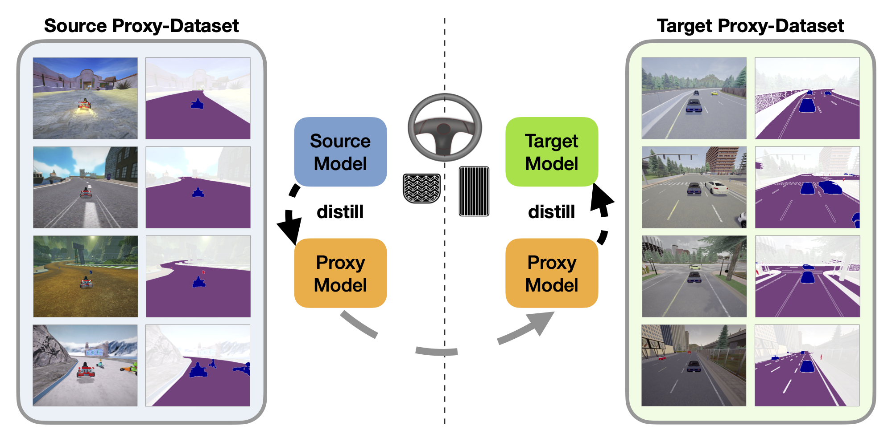
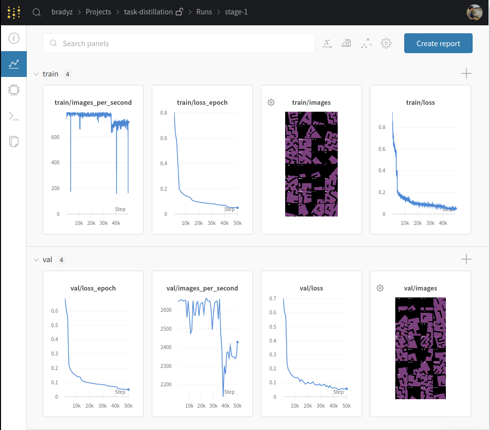
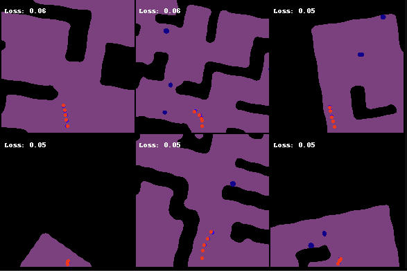
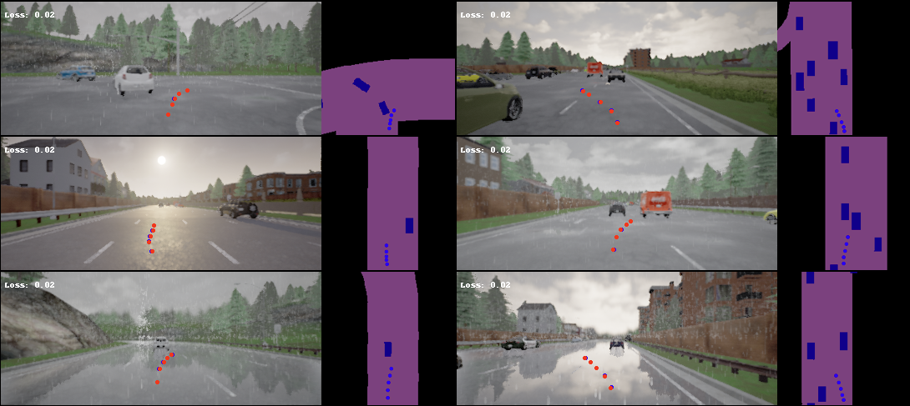

# Domain Adaptation Through Task Distillation


> **Domain Adaptation Through Task Distillation**  
> Brady Zhou\*, Nimit Kalra\*, Philipp Kr&auml;henb&uuml;hl,  
> [European Conference on Computer Vision](https://eccv2020.eu) (ECCV 2020)

```bibtex
@inproceedings{zhou2020domain,
    title={Domain Adaptation Through Task Distillation},
    author={Zhou, Brady and Kalra, Nimit and Kr{\"a}henb{\"u}hl, Philipp},
    booktitle={ECCV},
    year={2020}
}
```

# Installation

* Grab a copy of our [data](https://drive.google.com/file/d/1PKJVyi_WeqX6NSRMfrl2D9ddpqov605e/view?usp=sharing) (7 gb) and extract.  
* Install the dependencies located in `requirements.txt`.
* **OPTIONAL:** To evaluate models (see them drive), download [CARLA 0.9.6](https://carla.org/2019/07/12/release-0.9.6/).

# Training - Stage 1 (Proxy Model)

The first step involves training the proxy model, which is used to transfer a source model from VizDoom to CARLA.  
The source model navigates a maze-like environment while avoiding poison bombs and we collect data that consists of rollouts generated by [DFP](https://github.com/intel-isl/DirectFuturePrediction).  

The proxy model takes in a local semantic map representation (two channels, floor and poison) and outputs future waypoints.  
This model only sees data from VizDoom.

```
python3 -m policy_transfer.train_stage1 --dataset_dir /home/bradyzhou/data/task-distillation-eccv20/vizdoom_data \\
    --source vizdoom \\
    --input_channels 2
```

This will generate a [wandb dashboard](https://app.wandb.ai/bradyz/task-distillation/runs/resnet18_0.0001_5e-06_128_1.0) with the training process.  
Open it in your browser and you should see something like this -



A properly trained model will output predictions like this -



# Training - Stage 2 (Target Model)

Next, we'll use this trained proxy model and distill it into a target model.  
The target model takes in raw RGB images from CARLA as input and outputs future waypoints.  
The future waypoints are generated by the proxy model, which now takes in the CARLA map representation as input (two channels, driveable area and obstacle).

Make sure the `/path/to/proxy/` directory contains both the `config.yaml` config file, and `model_*.t7` weights file.

```
python3 -m policy_transfer.train_image_v2.py --dataset_dir /home/bradyzhou/task-distillation-eccv20/carla_data \\
    --source carla \\
    --input_channel 3 \\
    --teacher_path /path/to/proxy/model_050.t7
```

This will generate a [wandb dashboard](https://app.wandb.ai/bradyz/task-distillation/runs/resnet18_0.0001_5e-06_64_1.0) dashboard with the training process.  
Open it in your browser and you should see something like this -


A properly trained model will output predictions like this -



# Evaluation

If you don't want to train from scratch, you can go to [wandb project](https://app.wandb.ai/bradyz/task-distillation).  

* Go to the `stage-2` run
* Click on `files`
* Download `model_020.t7` and `config.yaml`

Start the CARLA Server by going to the `CARLA_0.9.6` directory and running

```
./CarlaUE4.sh -world-port=2000
```

Next, in another terminal window, add the CARLA `.egg` to your python path via

```
export PYTHONPATH=$PYTHONPATH:/path/to/CARLA_0.9.6/PythonAPI/carla/dist/carla-0.9.6-py3.5-linux-x86_64.egg
```

Then you can run the evaluation.  
Make sure `/path/to/weights/` contains both `config.yaml` and `model_*.t7`.

```
python3 -m policy_transfer.eval --agent_class ImageAgent \\
    --debug \\
    --port 2000 \\
    --pid 1 \\
    --agent_args /path/to/weights/model_020.t7
```
